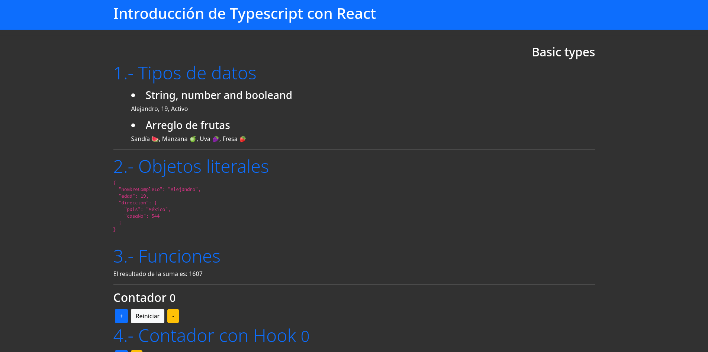
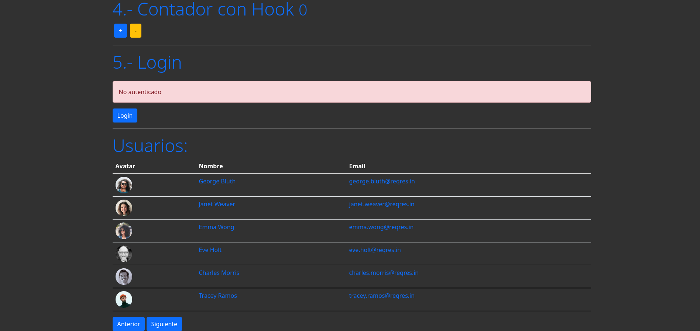

# Reforzamiento Typescript

_El objetivo de este proyecto con ejercicios es reforzar conocimientos en react con typescript_

## Funciones 🚀

_Tipado de las funciones, crear interfaces, types, peticiones http, hooks, uso de useReducer, etc!_

### Pre-requisitos 📋

- node
- npm

<hr>
### Reconstruir los modulos de Node 👷🏾‍♂️

```
    npm install
```

<hr>

<hr>

